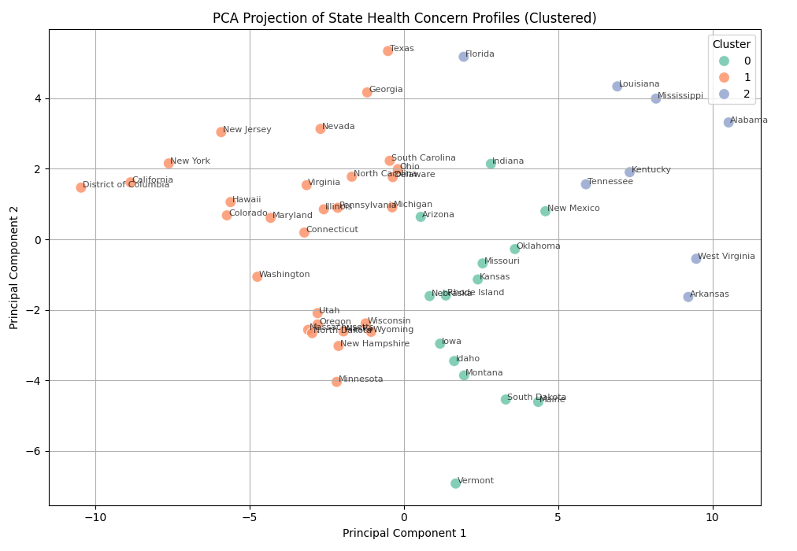
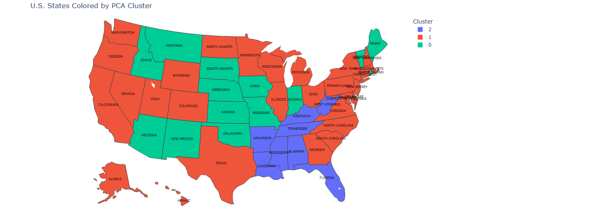
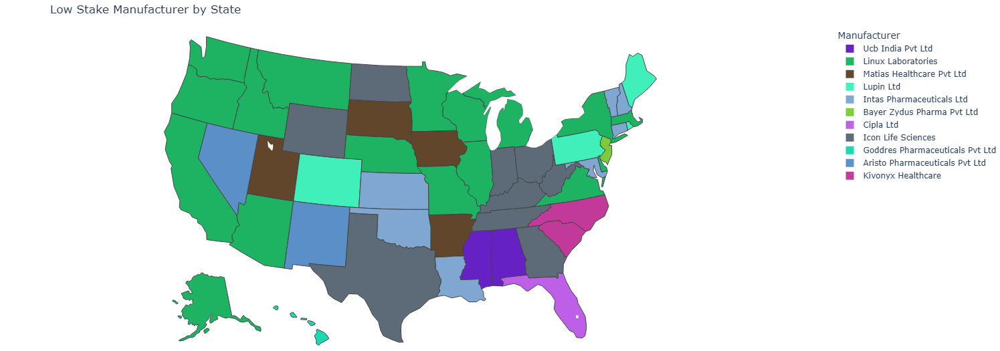
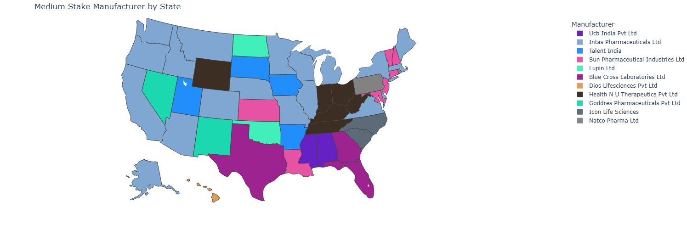
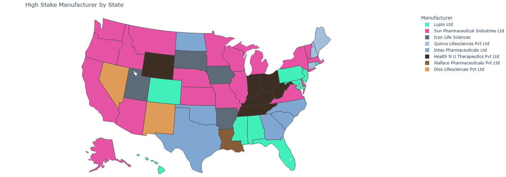

# Integrating Epidemiological Indicators and Regional Trend Analytics for Predictive Modeling of Drug Demand and Supply Vacuums
## Datasets  
[U.S. Food & Drug Administration](https://www.fda.gov/drugs/development-approvalprocess-drugs/drug-approvals-and-databases)  
[Google Trends](https://trends.google.com/trends/)  
[Kaggle](https://www.kaggle.com/singhnavjot2062001/datasets)  
[Open Prescribing](https://openprescribing.net/)  

## Risk Scoring  

## Cluster Analysis  

## Competitive Analysis  

